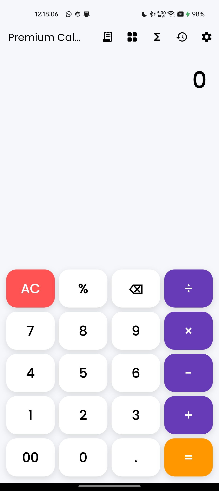
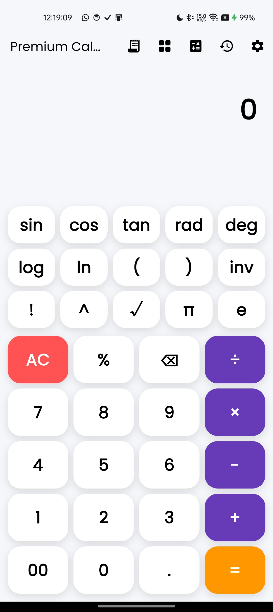
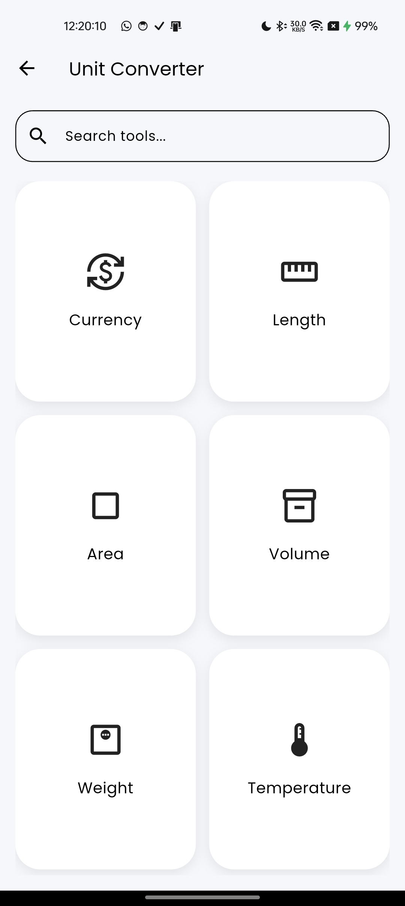
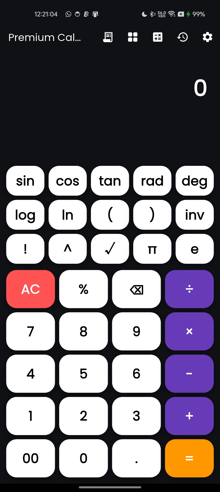
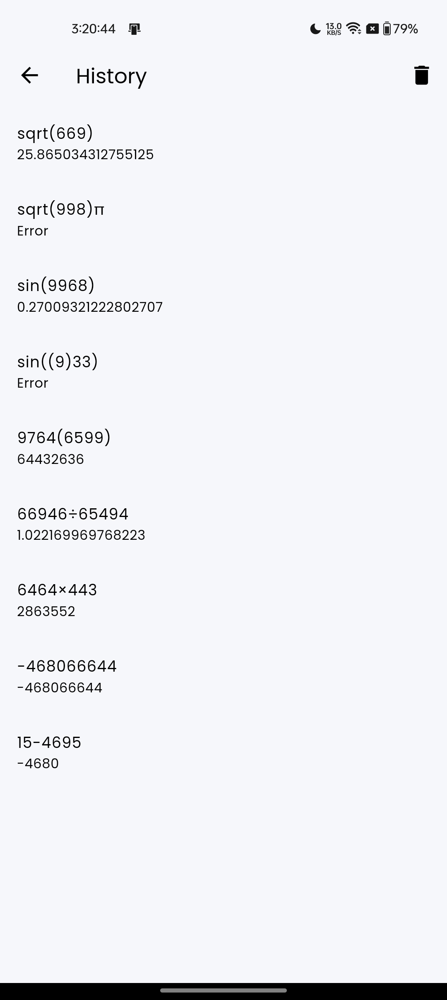

# Premium Calculator App

A modern Flutter Calculator App with:

- Basic Calculator
- Scientific Calculator
- GST Calculator
- Unit Converters
- Currency Converter
- Dark/Light Theme
- Calculator History
- Smooth UI Animations
- Responsive Design

---

# Features

## Calculator
- Basic arithmetic operations
- Scientific calculations
- Expression evaluation
- Real-time expression preview
- Backspace support
- Animated display section

## GST Calculator
- Add GST
- Remove GST
- Multiple GST percentage options

## Unit Converter
- Length
- Area
- Volume
- Weight
- Speed
- Pressure
- Power
- Temperature
- Number System

## Currency Converter
- Multiple currencies
- Live conversion support
- Searchable dropdowns

## UI/UX
- Dark Mode
- Smooth transitions
- Responsive utility grid
- Search functionality
- Custom app icon
- Native splash screen

---

# Tech Stack

- Flutter
- Dart
- Provider
- Hive
- math_expressions
- dropdown_search

---

# Screenshots

| Home Screen                   | Scientific Calculator                     |
|-------------------------------|-------------------------------------------|
|  |  |

| Unit Converter                          | Dark Mode                     |
|-----------------------------------------|-------------------------------|
|  |  |

| GST Calculation             | History                             |
|-----------------------------|-------------------------------------|
|  |  |

---

# APK Download

Download latest APK from Releases section.

---

# Installation

```bash
git clone https://github.com/karangoplani72/premium-calculator-flutter.git
```

```bash
flutter pub get
```

```bash
flutter run
```

---

# Developer

Karan Goplani

Portfolio:
www.karangoplani.in

GitHub:
https://github.com/karangoplani72